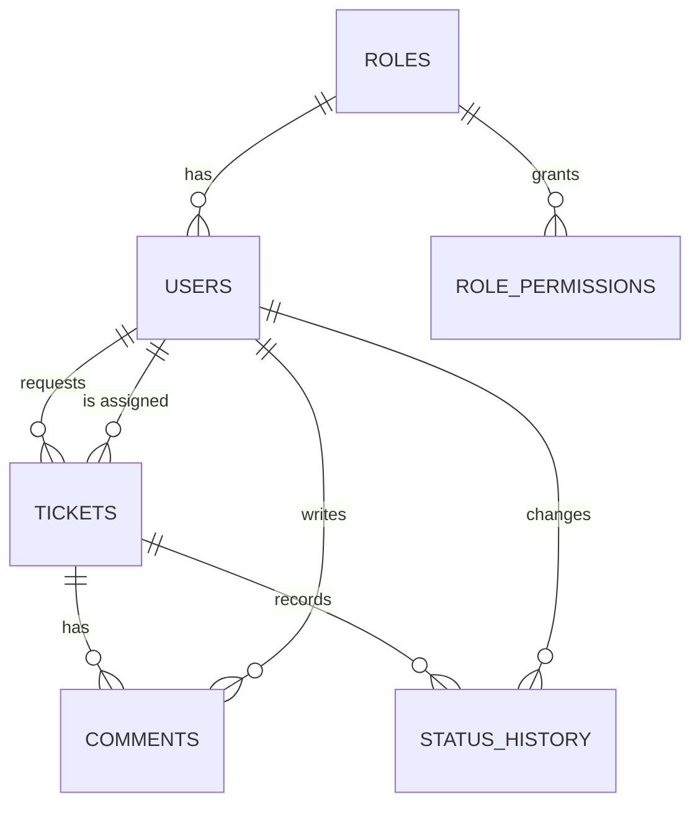

# CampusDesk architecture

## Layers (RT-01)
```
Browser (HTML/CSS/JS, fetch + JWT)
   |  HTTP/JSON, CORS restricted to the frontend origin
Controller  ->  Service  ->  Repository (Spring Data JPA)  ->  PostgreSQL
   |              |
  DTO       Access policy / business rules
Security (JWT filter, @PreAuthorize)   Exception (GlobalExceptionHandler)
```
Beans are wired by Spring constructor injection. Controllers contain no business logic.

## Data model

Entities required by RT-02: `User`, `Ticket`, `Comment`, `StatusHistory`. `Role` (+ `role_permissions`) was
added so an administrator can create roles from the UI.

## Life cycle (RF-04)
| From | To | Who | Endpoint |
| --- | --- | --- | --- |
| OPEN | ASSIGNED | Admin (`TICKET_ASSIGN`) | `PATCH /tickets/{id}/assign` |
| ASSIGNED | ASSIGNED (reassign) | Admin | `PATCH /tickets/{id}/assign` |
| ASSIGNED | IN_PROGRESS | Assigned technician | `PATCH /tickets/{id}/status` |
| IN_PROGRESS | RESOLVED | Assigned technician | `PATCH /tickets/{id}/status` |
| RESOLVED | CLOSED | Requester only | `PATCH /tickets/{id}/status` |

Any other transition returns **409**. A valid transition by the wrong person returns **403**. Each change and
its `status_history` row are saved in the same transaction. The first history row (null to OPEN) is created with the ticket.

## Permission catalog
`TICKET_CREATE`, `TICKET_READ_OWN`, `TICKET_READ_ASSIGNED`, `TICKET_READ_ALL`, `TICKET_EDIT_OWN`,
`TICKET_CLOSE_OWN`, `TICKET_ASSIGN`, `TICKET_WORK`, `COMMENT_CREATE`, `USERS_READ`, `USERS_MANAGE`, `ROLES_MANAGE`.

- Default **USER**: create, read/edit/close own, comment.
- Default **TECHNICIAN**: read assigned, work, comment.
- **ADMIN**: all.
- A user is assignable as technician when enabled and their role has `TICKET_WORK`.
- Safety rules: system roles cannot be edited or deleted, a role in use cannot be deleted, an administrator cannot
  disable or demote themselves, and the last active administrator cannot be removed.

## Security (RT-05)
- `POST /auth/login` returns a JWT (subject = email, expiration from `JWT_EXPIRATION`).
- `JwtFilter` validates the token and reloads the user on **every request**, so role changes and disabled
  accounts apply immediately. Missing/invalid/expired token returns 401 (JSON).
- Passwords stored with BCrypt. Policy: 8-72 chars, upper, lower, digit, symbol.
- Secrets live in `application-dev.properties` (local, fake values); replace them before publishing.
- Swagger has a global Bearer scheme so protected endpoints can be tested.

## Mandatory test cases
Status names are in English (OPEN = ABIERTA, ASSIGNED = ASIGNADA, IN_PROGRESS = EN_PROCESO, RESOLVED = RESUELTA, CLOSED = CERRADA).

| Code | Scenario | Expected | How to demonstrate |
| --- | --- | --- | --- |
| CP-01 | Register a valid user | Account with role USER | Register form or `POST /auth/register` |
| CP-02 | Register a duplicate email | Rejected (409) | Register the same email twice |
| CP-03 | Log in correctly | Valid JWT | `POST /auth/login` |
| CP-04 | Protected endpoint without token | 401 | `GET /tickets` without Authorize |
| CP-05 | Create a ticket | Status OPEN | New request |
| CP-06 | USER reads someone else's ticket | 403 | Open another user's `/tickets/{id}` |
| CP-07 | ADMIN assigns a technician | Ticket becomes ASSIGNED | Admin tab or detail page |
| CP-08 | USER tries to assign | 403 | `PATCH /tickets/{id}/assign` as USER |
| CP-09 | Technician edits a foreign ticket | Rejected (403) | `PUT /tickets/{id}` as technician |
| CP-10 | Resolve without IN_PROGRESS | 409 | `PATCH status RESOLVED` on an ASSIGNED ticket |
| CP-11 | Status change | History row created | Ticket detail > History |
| CP-12 | Requester closes a RESOLVED ticket | CLOSED | *Confirm and close* |
| CP-13 | Comment on a CLOSED ticket | Rejected (409) | `POST /tickets/{id}/comments` |
| CP-14 | Statistics | Match PostgreSQL | Dashboard vs `SELECT status, count(*) FROM tickets GROUP BY status;` |
| CP-15 | Frontend consumes the API | Successful communication | Browser on `localhost:5500 (nginx container)` |
| CP-16 | Invalid or expired JWT | 401 | Edit the token in Swagger or wait for expiry |

Unit tests already covering CP-06 to CP-10, CP-12, CP-13: `TicketServiceTests`. JWT validity (CP-16): `JwtUtilTests`.
